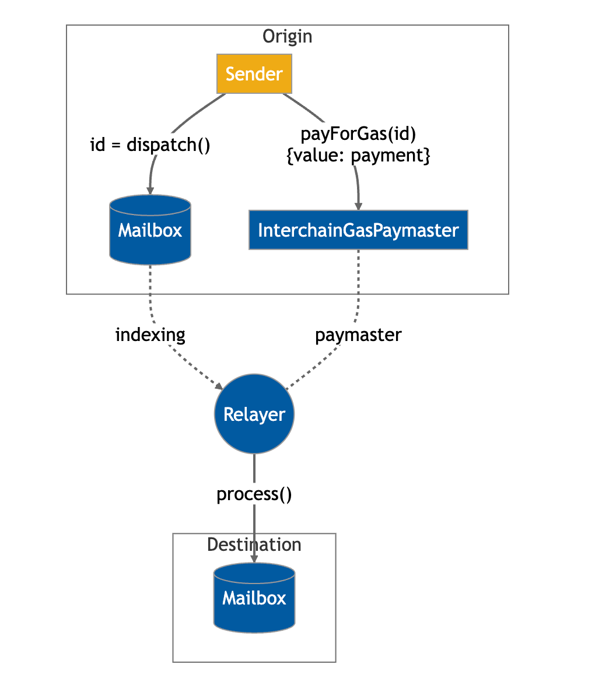
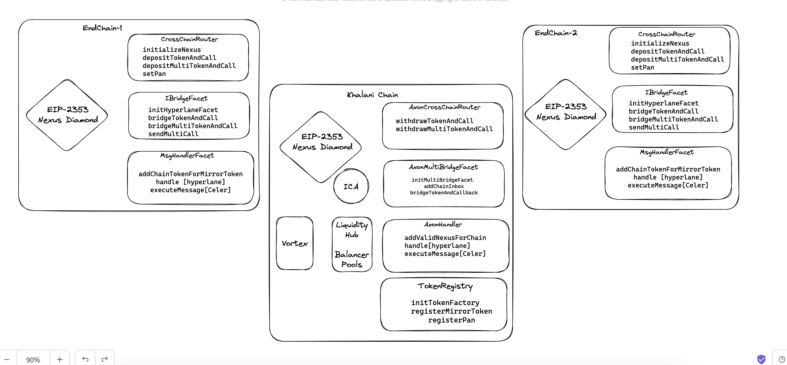

# Overview
The smart contracts in Khalani use EIP-2353 [(Diamond Pattern - MultiFacet Proxy)](https://eips.ethereum.org/EIPS/eip-2535).
A diamond is a contract with external functions that are supplied by contracts called facets. Facets are separate, independent contracts that can share internal functions, libraries, and state variables.

## AMP
For cross-chain communication, currently Khalani only uses Hyperlane. More specifically , Khalani relies on Hyperlane's Messaging API

# Contracts
Nexus diamond is deployed on all end chains as well as on Khalani Chain, however the facets on Khalani chain are different to facets on other chains.
The reason behind different facets on Khalani chain is due to the following reason:
1. ICA (interchain accounts) is created for the address from which transaction was originated.
2. Management of cross-chain liquidity happens on Khalani chain

## Nexus diamond and facets on non-khalani chains:
### CrossChainRouter
CrossChainRouter's interface provides the depositTokenAndCall functions and functions to register nexus's storage with `Kai's address` , `Nexus on axon` and `axon's chain id`

### IBridgeInterface
This interface is implemented by `HyperlaneFacet` and `CelerFacet` , this interface provides bridging function that implement the **_outbox adapter logic_** to integrate with any kind of bridge. The implementing facet should also have a function to register

### MsgHandlerFacet
This implements the functions required to handle cross-chain message from the relayer for example , `handle` function of hyperlane and `executeMessage` function of celer.

## Nexus diamond and Facets on Khalani Chain
### AxonCrossChainRouter
AxonCrossChainRouter's interface provides the withdrawTokenAndCall functions

### AxonHandler
This implements the functions required to handle cross-chain message from the relayer for example , `handle` function of hyperlane and `executeMessage` function of celer. It also provides a function to **_validate Nexus on other chains_** where the call comes from -  `addValidNexusForChain`

### StableTokenRegistry
This provides the interface to register Khalani Protocol's tokens.. i.e Mirror and Kai token, it also provides a function to register the mapping between end-chain's canonical asset and its representation on Khalani chain.

## Khalani Tokens
Multiple Tokens on Khalani Chain are deployed, these tokens are owned by the protocol.
Mirror Tokens : These are ERC20 tokens and they also register the chain id of the source chain's token it is mirroring to.
Kai : Khalani's Stable coin

## Vortex Wrapper
This contract provides the functions to execute an arbitrary batchswap with liquidity hub's balancer pools,
This contract also provides functions to provide liquidity and withdraw from Khalani Pools

## InterChainAccounts
ICAs can be thought of a wallet for each user interacting with the Khalani protocol. Interchain accounts help user to execute a series of calls on Khalani chain using any remote chain. It also holds user's bridged funds  and LP tokens of the liquidity hub