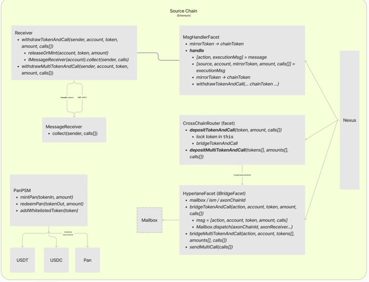
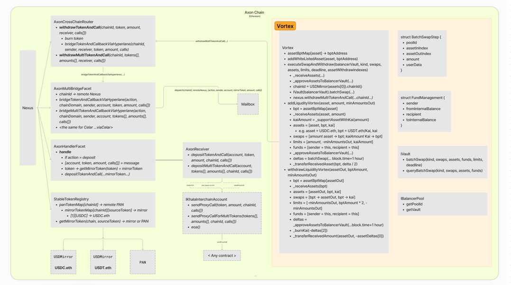

# V0 Deployment 
## Background :
### EIP-2353 Diamond Proxy
The core idea is identical to the proxy pattern, but with the difference that you can have multiple logic contracts.
- The proxy is called diamond proxy
- The logic contracts are called facets, and they are stored in a mapping called facetAddresses which maps the function selector to the address of the facet
- The diamond proxy has a function called diamondCut, which allows you to add, remove or replace facets
- This pattern allows us to upgrade the proxy on a per-function basis.




### EIP-2353 Deployment Process 
Read [Diamond Deployments and Diamond Upgrades Section](https://eip2535diamonds.substack.com/p/introduction-to-the-diamond-standard)
- To deploy a diamond proxy, you need to deploy the diamond proxy contract and then add the facets using the diamondCut interface. 


## Deployment Steps
#### Inject your private key
The deployment script will use this key to sign the transactions.
```bash
export PRIVATE_KEY=<raw_private_key>
```
#### Configure `deploy_config.json`
```json
{
  "khalanitestnet": {
    "chainId": 10012,
    "rpcUrl": "<rpc_url>",
    "hyperlaneMailbox": "<hyperlane_mailbox_address_khalani>",
    "hyperlaneISM": "<hyperlane_ism_address_khalani>",
    "tokens": []
  },
  "goerli": {
    "chainId": 5,
    "rpcUrl": "<rpc_url>",
    "hyperlaneMailbox": "<hyperlane_mailbox_address_goerli>",
    "hyperlaneISM": "<hyperlane_ism_address_goerli>",
    "tokens": []
  },
  "fuji": {
    "chainId": 43113,
    "rpcUrl": "<rpc_url>",
    "hyperlaneMailbox": "<hyperlane_mailbox_address_fuji>",
    "hyperlaneISM": "<hyperlane_ism_address_fuji>",
    "tokens": []
  }
}
```
Similarly, you can add more chains to the config file.

Note: For V0 test net the, tokens array should be empty, as the tokens are deployed through a script and the script populates the tokens array.

### 1. Deploy Test Stable Coin on a remote chain
Script: `scripts/shell/01_deploy-fake-stable.sh`

To deploy TOKENS(name) with DECIMALS to a REMOTE chain edit the following variables in the script and run it:
```bash
export REMOTE=<chain_name_in_deploy_config>
export TOKENS=<comma separated list of token names>
export DECIMALS=<comma separated list of decimals>
```
The output of this script : `config/test_stables.json`

### 2. Deploy Nexus, Kai and PSM on axon chain and multiple remote chains
Script: `scripts/shell/02_deploy-nexus-multichain.sh`

To deploy Nexus on AXON and REMOTE chains edit the following variables in the script and run it:
```bash
export AXON=<chain_name_in_deploy_config>
export REMOTES=<comma separated list of chain names in deploy config>
```
The output of this script : `config/networks.json`
This script will also populate the tokens array in the `deploy_config.json` file.

### 3. Deploy Mirror Tokens on axon chain for all the assets that Khalani support on a REMOTE chain
Script: `scripts/shell/03_deploy-mirror-tokens.sh`

To deploy Mirror Tokens on AXON chain edit the following variables in the script and run it:
```bash
export REMOTE=<chain_name_in_deploy_config>
```
The output of this script : `config/tokens.json`

### 4. Run post deployment linking script
Script: `scripts/shell/04_post_deploy_axon_linker.sh`
Use this script to register the remote chain's nexus and Kai tokens to the axon chain's Nexus.
```bash
export REMOTES=<command separated list of remote chain names in deploy config>
```

### 5. Mint test stable coins, bridge them to axon chain
Use this script to mint test stable coins on the remote chain and bridge them to axon chain.
This script registers the remote chain's stable coins to the PSM. Exchanges the AMOUNT of stable coins for Kai and then bridges the Kai to the axon chain.
The bridges tokens are then transferred to the balancer pool deployer's address
Script: `scripts/shell/05_bridge-token.sh`
```bash
export REMOTE=<chain_name_in_deploy_config>
export POOL_DEPLOYER=<pool_deployer_address>
export AMOUNT=<unscaled_amount>
```
